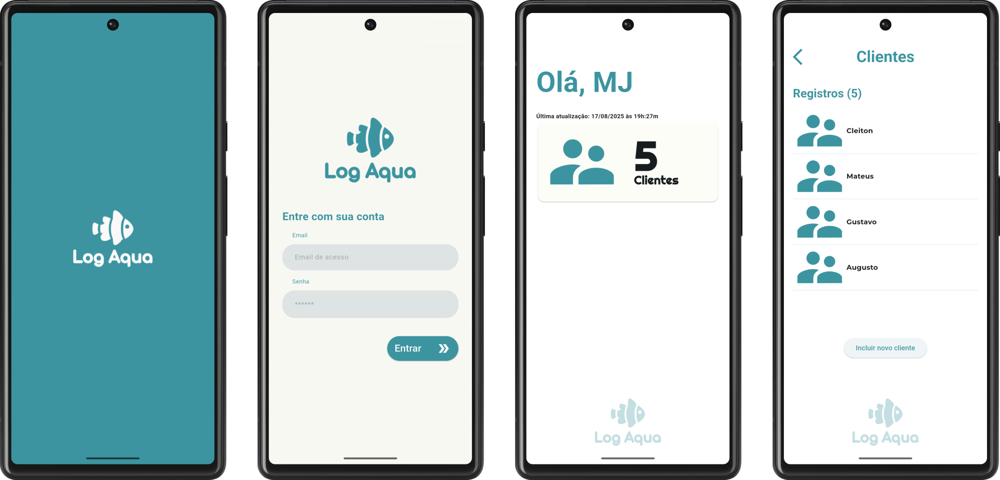
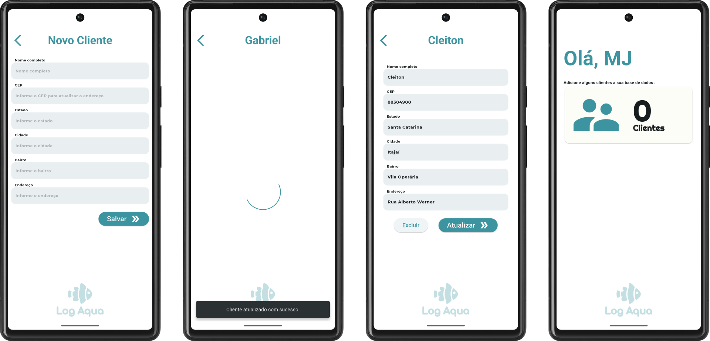

# O proposito da aplicação

Este é um aplicativo utilizado para gerenciar cadastro de clientes salvando-os em um banco de dados offline. O usuário constará com uma lista de todos os clientes em formato de dashboard e tem a capacidade de cadastro. Ele possui uma funcionalidade que consulta uma API púiblica do [https://viacep.com.br/](https://viacep.com.br/)

# Para executar
Para iniciar o software, clone este repositório remoto para o seu repositório local. Depois disso, é recomendável verificar se tudo está funcionando corretamente no seu ambiente com o comando **flutter doctor**. Com o emulador Android em execução ou um dispositivo conectado ao seu computador/laptop via cabo USB, execute o comando flutter run.

Caso queira instalar o APK em algum dispositivo Android, execute **adb install app-release.apk**, se o app já estiver instalado use o parametro -r para atualizar o aplicativo mantendo os dados existentes no banco de dados.

Para executar os testes básicos implementados, use o comando **flutter test**.

# Informações uteis para análise do código

- A tela de login possui apenas uma **validação simples dos campos de entrada**.  
    - Para o campo de e-mail, basta que a string contenha o caractere *@*.  
    - Para o campo de senha, é exigido um mínimo de *6 dígitos*.  
- Este projeto segue uma arquitetura feature-first, organizando o código por funcionalidades. A pasta **core/** contém componentes compartilhados utilizados em toda a aplicação.
- Boa parte das regras de negócio estão localizadas no arquivo cliente_repository.dart
- A tela de formulário é reutilizada tanto para cadastro quanto para edição de clientes, variando apenas conforme a existência (ou não) de um objeto Cliente.
- As fontes utilizadas foram baixadas de uma fonte oficial e segura: **Google Fonts**.  

### Principais bibliotecas e seus propósitos

- *flutter_native_splash* e *flutter_launcher_icons*: úteis para simplificar o processo de configuração do ícone do aplicativo e da tela inicial
- *bloc*:  biblioteca utilizada para implementar o padrão BLoC, auxiliando principalmente na criação de ferramentas de controle de estado de forma mais simplificada
- *flutter_bloc*: usado como uma extensão da biblioteca bloc, utilizado para facilitar a integração entre a lógica de negócios (bloc) e os widgets do Flutter.
- *page_transition*: simplifica o processo de transições animadas
- *http*: Criação de requisições HTTP.
- *convert*: Conversão e manipulação de JSON.
- *sqflite*: Banco de dados SQLite para persistência dos dados locais.  
- *path*: Utilizado para obter o diretório correto do sistema operacional e compor o caminho onde o banco de dados será salvo.  
- *mocktail*: usado apenas em testes, usado para criar "falsos objetos" (mocks) de dependência como banco de dados.

### Considerações finais

Foi adotado ao máximo os templates contidos no documento de requisitos, entretanto, para as funcionalidades de 'Incluir novo cliente', 'excluir' e 'atualizar' abusei um pouco da liberdade criativa para desenvolver a implementação conforme o documento solicitava.

O projeto foi bastante interessante de ser executado, tanto do ponto de vista técnico quanto de aprendizado. Procurei evitar ao máximo boilerplate, mantendo a estrutura limpar e modularizada. Ainda assim, futuras refatorações e novas funcionalidades podem ser exploradas a partir de feedbacks ou evoluções dos requisitos.

Deixo logo abaixo algumas imagens da aplicação:

## Changelog

- **18/08/2025** - Commit inicial: estrutura básica do projeto
- **21/08/2025** - Atualização: corrigido erro no teclado ao sair da tela do formulário